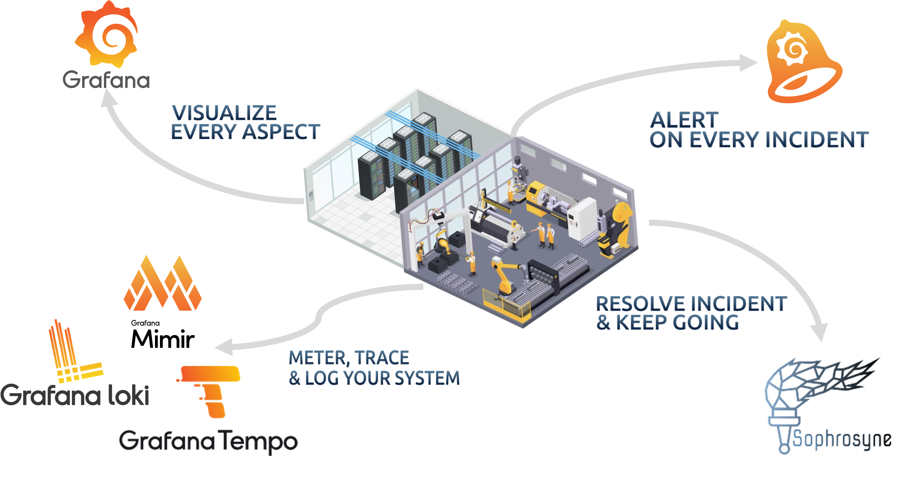
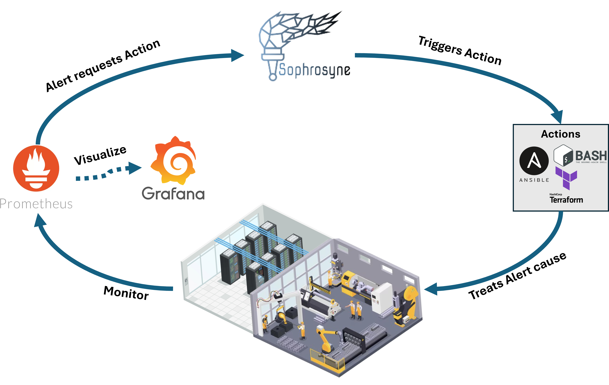
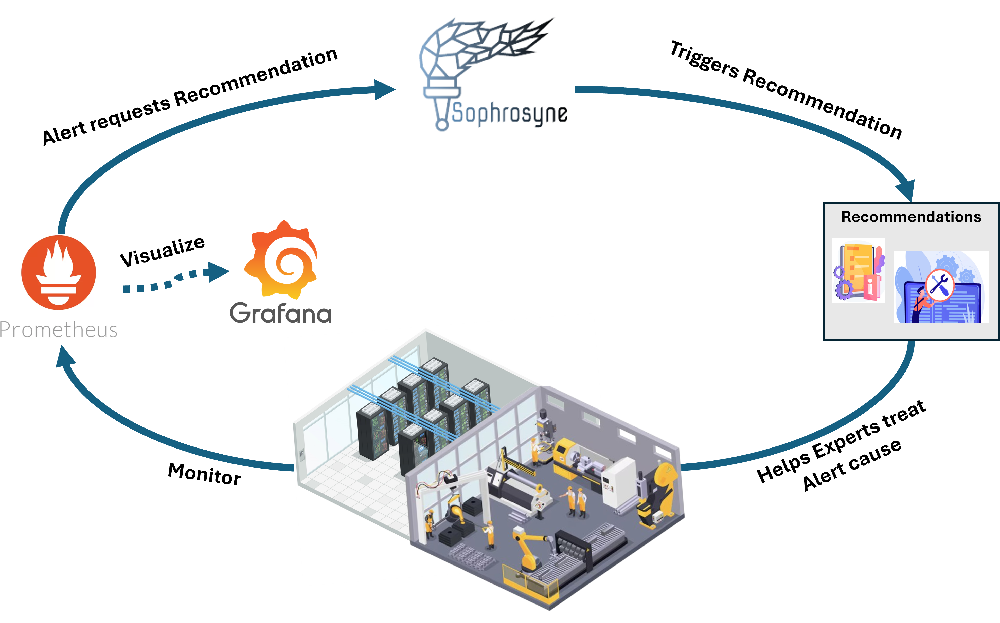

# Sophrosyne

## 📑 Table of Contents
1. [What is Sophrosyne?](#-what-is-sophrosyne)
2. [Repository Structure](#-repository-structure)
3. [Documentation & Installation](#-documentation--installation)

---

## 🚀 What is Sophrosyne?

Sophrosyne is an open-source automation platform that enhances alert management by bridging the gap between monitoring and action.

It allows your infrastructure to automatically evolve by reacting to alerts or events using custom commands, scripts, or software. Where automation cannot be applied (e.g., hardware incidents), Sophrosyne delivers precise recommendations to your support teams.

### Key Features:
- 🔹 **Automatic Incident Response**: Execute Ansible playbooks, scripts, configuration changes, deployments, or integrations with other tools in response to alerts via Sophrosyne's API.  
- 🔹 **Manual Control**: Trigger actions manually through an intuitive Web UI for on-demand system management.  
- 🔹 **Knowledge Preservation**: Store, document, and reuse fixes, routines, and maintenance actions, reducing dependency on individual experts and ensuring consistent resolutions.

---

### 🔍 Enhance Your Alert & Incident Response

Sophrosyne complements your data center monitoring by allowing it to automatically react to alerts.  
It integrates with any monitoring ecosystem like **Prometheus** where alerts can make REST calls.  
It offers flexible APIs for triggering actions (any piece of software) countering the source of an alert.

 
   

---

### 🛠️ Actions & Dynamic Actions

Sophrosyne supports **Actions**, which are any pieces of software or commands designed to counter the source of an alert.

#### Two Types of Actions:
- **Simple Action** – Executes a fixed remediation without parameters.  
- **Dynamic Action** – Allows parameter passing at execution time for flexible responses.

Actions can be triggered:
- Automatically by REST Calls (e.g., from Prometheus webhooks).  
- Manually via Sophrosyne’s Web Interface.

#### Action Confirmation Requests
Some actions may require an additional confirmation before execution.  
These are managed through the **Action Confirmation Menu**, ensuring controlled and safe automation.

 
   

---

### 💡 Action Recommendations: Supporting Your Experts

Not all incidents can be resolved by code.  
For hardware issues or cases requiring manual intervention, Sophrosyne provides **Action Recommendations**.

These recommendations:
- Are triggered the same way as automated actions.  
- Deliver targeted and helpful information to support teams.  
- Can define responsible personnel, include HTML-rendered instructions, and attach supporting documents.

 
   

---

### 📚 Preserving & Applying Operational Knowledge

Sophrosyne ensures operational expertise is captured and reused:
- ✅ Reduces dependency on individual experts.  
- ✅ Allows less experienced staff to execute complex tasks reliably.  
- ✅ Standardizes best practices for consistent issue resolution.

---

## 📂 Repository Structure

This repository contains both the **UI** and **Backend** code:

- `ui/` – The frontend user interface for managing actions, incidents, and recommendations.  
- `core/` – The backend service handling automation logic, API calls, and alert/event processing.  

Although both services are **decoupled**, they are currently **installed via a single package**.

---

## 📖 Documentation & Installation

For more detailed information, including the **installation guide**, **package**, and **API description**, please visit the official documentation:

👉 [http://docs.sophrosyne.ep-monitoring.com/#/](http://docs.sophrosyne.ep-monitoring.com/#/)

---
